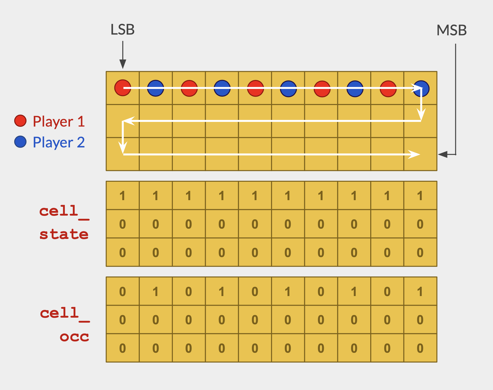
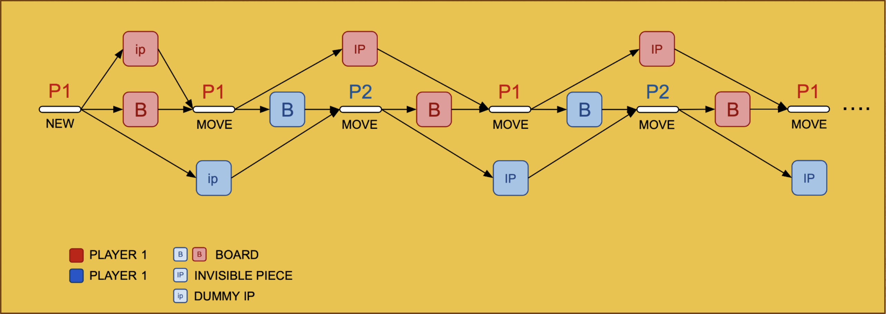
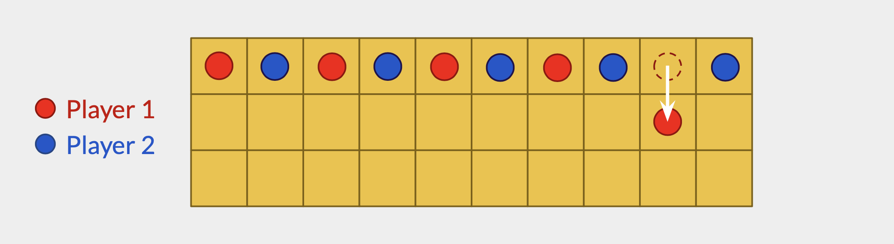
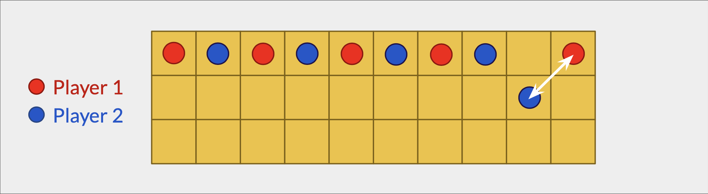
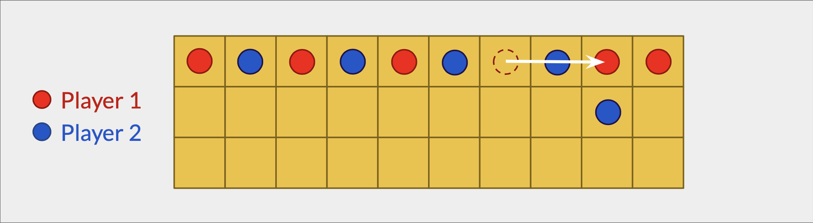
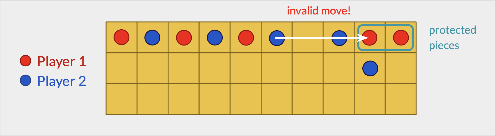
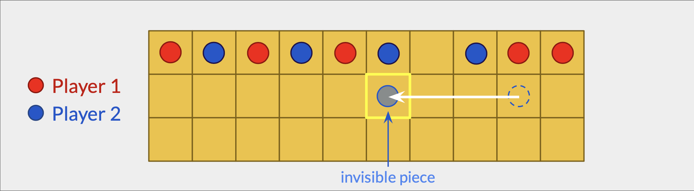
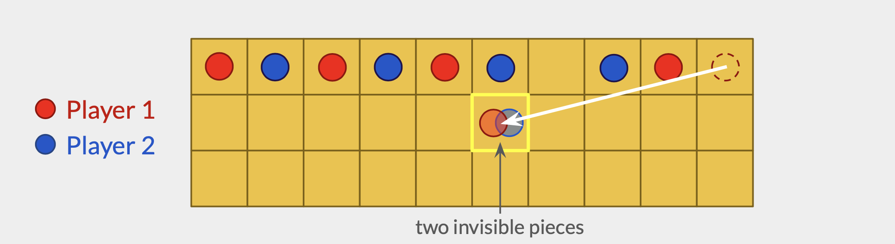
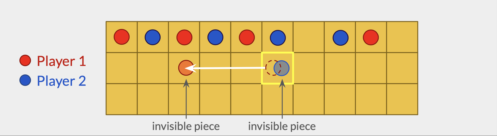

# The Game of Zenet


## The original Senet game

Senet is one of the oldest known board games, originating in ancient Egypt around 3100 BCE. It was a popular game among all social classes, from pharaohs to commoners.

Senet boards have been found in tombs, including the tomb of Tutankhamun, indicating its cultural significance and association with the afterlife.

It's a two-player game, played on a rectangular board with 30 squares arranged in three rows of ten. Each player has five pawns, which they move across the board according to the roll of casting sticks or dice.

The objective is to be the first player to move all their pawns off the board, symbolizing the journey through the afterlife. Players must navigate through a series of special squares with unique properties or rules, representing various stages of the afterlife journey. Some squares allow players to move forward, some send players back, and some block movement entirely.

If a player rolls a 1, 4, or 5 on the dice, they are granted an additional turn, which they can take immediately after completing their current turn. This continues until the player rolls either a 2 or 3, at which point the other player takes their turn.


## Zenet: The Modern Version

In Zenet, there's an added element of mystery and magic, as pieces can become invisible after landing on the 15th tile, known as the House of Second Life.

This new rule of invisibility increases the complexity and strategy of the game, as players must adapt their moves and tactics based on hidden information.

To maintain privacy and ensure fair gameplay, Zenet uses zero-knowledge proofs to verify the legality of moves without revealing the actual positions of the invisible pieces.

Using zero-knowledge proofs in Zenet adds an extra layer of intrigue and excitement, as players must constantly adapt to the hidden aspects of the game and make strategic decisions based on incomplete information.

### Some benefits of Using Zero-Knowledge Proofs in Zenet:
- Privacy: Players' moves involving invisible pieces remain hidden, preserving the element of mystery and surprise throughout the game.
- Security: Zero-knowledge proofs protect against cheating, ensuring that all moves are legal and follow the rules of the game without disclosing sensitive information.
- Trust: The use of cryptographic techniques like zero-knowledge proofs establishes trust between players, as they can be confident that their opponent is not gaining an unfair advantage.


## Implementation Details

Zenet boards are represented by 32-bit unsigned integers. The first 30 bits represent the 30 cells in a Zenet board.

We use two 32-bit integers:

- `cell_state`: `0` means the cell is empty, `1` means the cell is occupied.

- `cell_occ`: `0` means the occupant is Player 1, `1` means it's Player 2.

When referring to individual cells, we use a 8-bit integer, with the following convention:
- `0u8`: Empty cell
- `1u8`: Player 1
- `2u8`: Player 2

For both `cell_state` and `cell_occ`, the less-significant bit (LSB) represents the first tile or cell, while the most-significant bit (MSB) represents the last one.

The board's initial configuration is always the same: each player starts with five game pieces, which are placed alternately in the first ten cells of the board.

So, the initial values for `cell_state` and `cell_occupant`, are as follows:

- `cell_state` = `00000000000000000000001111111111` = `1032u32`
- `cell_occ` = `00000000000000000000001010101010` = `682u32`



### Records

The state of the game is kept on-chain with the help of two different records:
A `Board` record that represents a Zenet board.

An `InvisiblePieces` record, that represents the invisible pieces for each player.

The ownership of the `Board` is determined by the player whose turn is next, This means that both players are aware of the positions of each other's visible pieces, but not their invisible pieces. 

For that reason, each player must keep track of their own invisible pieces. To ensure fairness and prevent cheating, the positions of these invisible pieces are kept private using an `InvisiblePieces` record for each player.

```javascript
record Board {
    owner: address,
    gates: u64,
    cell_state: u32,
    cell_occ: u32,
    p1: address,
    p2: address
}

record InvisiblePieces {
    owner: address,
    gates: u64,
    positions: u32
}
```


### Transitions

There are two different transitions implemented in the game of Zenet:

- `new()`: Creates a new `Board` and two `InvisiblePieces` records, one for each player.
- `move()`: Consumes a `Board` record, an `InvisiblePieces` record, an origin cell and a dice roll and generates an updated `Board` record, along with an updated `InvisiblePieces` record for the current player.

```javascript
transition new(
    opponent: address
) -> (Board, InvisiblePieces, InvisiblePieces)

transition move(
    origin_cell: u8, 
    dice: u8, 
    board: Board, 
    ip: InvisiblePieces
) -> (Board, InvisiblePieces) 
```

## Records and Transitions Diagram


## How to Build

To compile this Leo program, run:
```bash
leo build
```

## How to Run

### 1. Initializing the players

In order to play Zenet, there must be two players with a single board. Players will be represented by their Aleo address. You can use the provided player accounts or generate your own.

```
Player 1:
  Private Key  APrivateKey1zkpBUbGmWy43eKufUDiyHJc4VNMofLWBi1CgTq9GxoqNA3H
     View Key  AViewKey1eN3KuiU4bHKDJo5yM3WXm9RZWkg9hBPxG6yyKe6rnKJh
      Address  aleo172xc22y5jfzun0ezw7yfc55203sy6ufdvcugysqdw2ajpw86uc9q57enk3

Player 2:
  Private Key  APrivateKey1zkp7pHk17hq6cWoKQWJxAzHPwCupD6RECDjQZJk8t12BdEn
     View Key  AViewKey1ouyBkb64s8m6BnBf1e6ibVUpL2Bx28mgVFLwD9ndbQK3
      Address  aleo1qttvkxx3expu6ueqlwrydt7v0xjpqzmayeqsqlyha8d74u6q5srqfun7cj
```

Save the keys and addresses. Set the `program.json` private_key and address to one of the newly created aleo accounts. We'll refer to this address as Player 1, and the remaining address as Player 2.

```json
{
  "program": "zenet.aleo",
  "version": "0.0.0",
  "description": "",
  "development": {
      "private_key": "APrivateKey1zkpBUbGmWy43eKufUDiyHJc4VNMofLWBi1CgTq9GxoqNA3H",
      "view_key": "AViewKey1eN3KuiU4bHKDJo5yM3WXm9RZWkg9hBPxG6yyKe6rnKJh",
      "address": "aleo172xc22y5jfzun0ezw7yfc55203sy6ufdvcugysqdw2ajpw86uc9q57enk3"
  },
  "license": "MIT"
}
```
### 2. Player 1 creates a new Board.

Player 1 executes the `new()` transition with Player 2's address as a parameter:

**Run**
```bash
export PLAYER2_ADDRESS=aleo1qttvkxx3expu6ueqlwrydt7v0xjpqzmayeqsqlyha8d74u6q5srqfun7cj
leo run new $PLAYER2_ADDRESS
```
**Output**
```bash
🚀 Executing 'zenet.aleo/new'...

 • Executed 'new' (in 3596 ms)

⛓  Constraints

 •  'zenet.aleo/new' - 5,301 constraints (called 1 time)

➡️  Outputs

 • {
  owner: aleo172xc22y5jfzun0ezw7yfc55203sy6ufdvcugysqdw2ajpw86uc9q57enk3.private,
  gates: 0u64.private,
  cell_state: 1023u32.private,
  cell_occ: 682u32.private,
  p1: aleo172xc22y5jfzun0ezw7yfc55203sy6ufdvcugysqdw2ajpw86uc9q57enk3.private,
  p2: aleo1qttvkxx3expu6ueqlwrydt7v0xjpqzmayeqsqlyha8d74u6q5srqfun7cj.private,
  _nonce: 7210918210391669260639851365122112056150882955833617507636357358503179831132group.public
}
 • {
  owner: aleo172xc22y5jfzun0ezw7yfc55203sy6ufdvcugysqdw2ajpw86uc9q57enk3.private,
  gates: 0u64.private,
  positions: 0u32.private,
  _nonce: 310761922771395682817152413480995110831108802421135276464640650379690467960group.public
}
 • {
  owner: aleo1qttvkxx3expu6ueqlwrydt7v0xjpqzmayeqsqlyha8d74u6q5srqfun7cj.private,
  gates: 0u64.private,
  positions: 0u32.private,
  _nonce: 5063847865665357518111995648660364483466979801476404664891309029800811580865group.public
}

       Leo ✅ Executed 'zenet.aleo/new'
```

There are three outputs here: the `Board`, record owned by Player 1, and two `InvisiblePieces` records, owned by Player 1 and Player 2, respectively. Notice that the values for `cell_state` and `cell_occ` in the `Board` record are `1023u32` and `682u32`, respectively. These correspond to the initial board arrangement (see [Implementation Details](#implementation-details) above).

### 3. Player 1 makes their first move

Suppose that Player 1 rolls a 3 on the dice and wishes to move the game piece currently located on the 9th cell of the board to cell #12.

This is the resulting board after this move is executed:





**Run**
```bash
leo run move 9u8 3u8 "{
  owner: aleo172xc22y5jfzun0ezw7yfc55203sy6ufdvcugysqdw2ajpw86uc9q57enk3.private,
  gates: 0u64.private,
  cell_state: 1023u32.private,
  cell_occ: 682u32.private,
  p1: aleo172xc22y5jfzun0ezw7yfc55203sy6ufdvcugysqdw2ajpw86uc9q57enk3.private,
  p2: aleo1qttvkxx3expu6ueqlwrydt7v0xjpqzmayeqsqlyha8d74u6q5srqfun7cj.private,
  _nonce: 7890800848858615990577674120820649470995847806539552791604837931200094078541group.public
}" "{
  owner: aleo172xc22y5jfzun0ezw7yfc55203sy6ufdvcugysqdw2ajpw86uc9q57enk3.private,
  gates: 0u64.private,
  positions: 0u32.private,
  _nonce: 1260228892496565700320197992505338749301641373211925149244050801561814298023group.public
}"
```

**Output**
```bash
🚀 Executing 'zenet.aleo/move'...

 • Executed 'move' (in 7379 ms)

⛓  Constraints

 •  'zenet.aleo/move' - 55,450 constraints (called 1 time)

➡️  Outputs

 • {
  owner: aleo1qttvkxx3expu6ueqlwrydt7v0xjpqzmayeqsqlyha8d74u6q5srqfun7cj.private,
  gates: 0u64.private,
  cell_state: 2815u32.private,
  cell_occ: 682u32.private,
  p1: aleo172xc22y5jfzun0ezw7yfc55203sy6ufdvcugysqdw2ajpw86uc9q57enk3.private,
  p2: aleo1qttvkxx3expu6ueqlwrydt7v0xjpqzmayeqsqlyha8d74u6q5srqfun7cj.private,
  _nonce: 1409934603180638244566442530640648112189863997136401773590924503827538382529group.public
}
 • {
  owner: aleo172xc22y5jfzun0ezw7yfc55203sy6ufdvcugysqdw2ajpw86uc9q57enk3.private,
  gates: 0u64.private,
  positions: 0u32.private,
  _nonce: 3342391348509252132638747362471767332582120143448787704921363163570949568794group.public
}

       Leo ✅ Executed 'zenet.aleo/move'
```

After processing the turn, two records are produced. The first record is the updated `Board` record, which reflects the new positions of the pieces on the board. This record is owned by Player 2, as it is now their turn to play. The second record is an `InvisiblePieces` record, belonging to Player 1, who must keep the positions of their invisible pieces private.

### 3. Player 2 makes their first move

It is now Player 2's turn to play. Suppose they roll a 2 on the dice and wish to move their piece to cell #12, but find that this cell is already occupied by a piece belonging to Player 1. Because the piece on cell #12 is unprotected, Player 2 may opt to exchange the positions of the two pieces, moving their own piece to cell #12 and Player 1's piece to cell #10. This move is legal according to the rules of the game and can be a strategic advantage for Player 2, as they are able to displace their opponent's piece and occupy a more favorable position on the board.

This is the resulting board after this move is executed:



We must run the program as Player 2, so let's switch the `program.json` file to use Player 2's keys:
```json
{
  "program": "zenet.aleo",
  "version": "0.0.0",
  "description": "",
  "development": {
      "private_key": "APrivateKey1zkp7pHk17hq6cWoKQWJxAzHPwCupD6RECDjQZJk8t12BdEn",
      "view_key": "AViewKey1ouyBkb64s8m6BnBf1e6ibVUpL2Bx28mgVFLwD9ndbQK3",
      "address": "aleo1qttvkxx3expu6ueqlwrydt7v0xjpqzmayeqsqlyha8d74u6q5srqfun7cj"
  },
  "license": "MIT"
}
```

**Run**
```bash
leo run move 10u8 2u8 "{
  owner: aleo1qttvkxx3expu6ueqlwrydt7v0xjpqzmayeqsqlyha8d74u6q5srqfun7cj.private,
  gates: 0u64.private,
  cell_state: 2815u32.private,
  cell_occ: 682u32.private,
  p1: aleo172xc22y5jfzun0ezw7yfc55203sy6ufdvcugysqdw2ajpw86uc9q57enk3.private,
  p2: aleo1qttvkxx3expu6ueqlwrydt7v0xjpqzmayeqsqlyha8d74u6q5srqfun7cj.private,
  _nonce: 1004757177813353300822404771547701633947006730478073655279174959646155183747group.public
}" "{
  owner: aleo1qttvkxx3expu6ueqlwrydt7v0xjpqzmayeqsqlyha8d74u6q5srqfun7cj.private,
  gates: 0u64.private,
  positions: 0u32.private,
  _nonce: 1464789014133543903436410348591640130929288960599214445445608713474398327142group.public
}"
```

**Output**

```bash
🚀 Executing 'zenet.aleo/move'...

 • Executed 'move' (in 7733 ms)

⛓  Constraints

 •  'zenet.aleo/move' - 55,450 constraints (called 1 time)

➡️  Outputs

 • {
  owner: aleo172xc22y5jfzun0ezw7yfc55203sy6ufdvcugysqdw2ajpw86uc9q57enk3.private,
  gates: 0u64.private,
  cell_state: 2815u32.private,
  cell_occ: 2218u32.private,
  p1: aleo172xc22y5jfzun0ezw7yfc55203sy6ufdvcugysqdw2ajpw86uc9q57enk3.private,
  p2: aleo1qttvkxx3expu6ueqlwrydt7v0xjpqzmayeqsqlyha8d74u6q5srqfun7cj.private,
  _nonce: 1039118141875097626328197633966104112998758183168296489726732103100390161461group.public
}
 • {
  owner: aleo1qttvkxx3expu6ueqlwrydt7v0xjpqzmayeqsqlyha8d74u6q5srqfun7cj.private,
  gates: 0u64.private,
  positions: 0u32.private,
  _nonce: 4374165097099060839041382712567463929743439389720416064428914179105778454589group.public
}

       Leo ✅ Executed 'zenet.aleo/move'
```

Again, two records are produced. The first record is the updated `Board` record, belonging to Player 1, while the second one is an `InvisiblePieces` record, belonging to Player 2. 

### 4. Player 1 moves

Now it's Player 1's turn. Let's suppose they roll a 2 on the dice and wish to move their piece on cell #7 to cell #9.

This is the resulting board after this move is executed:



**Run**
```bash
leo run move 7u8 2u8 "{
  owner: aleo172xc22y5jfzun0ezw7yfc55203sy6ufdvcugysqdw2ajpw86uc9q57enk3.private,
  gates: 0u64.private,
  cell_state: 2815u32.private,
  cell_occ: 2218u32.private,
  p1: aleo172xc22y5jfzun0ezw7yfc55203sy6ufdvcugysqdw2ajpw86uc9q57enk3.private,
  p2: aleo1qttvkxx3expu6ueqlwrydt7v0xjpqzmayeqsqlyha8d74u6q5srqfun7cj.private,
  _nonce: 5863476156890724550843040600428608701027004669580939694903504655995771483413group.public
}" "{
  owner: aleo172xc22y5jfzun0ezw7yfc55203sy6ufdvcugysqdw2ajpw86uc9q57enk3.private,
  gates: 0u64.private,
  positions: 0u32.private,
  _nonce: 1260228892496565700320197992505338749301641373211925149244050801561814298023group.public
}"
```

**Output**
```bash
🚀 Executing 'zenet.aleo/move'...

 • Executed 'move' (in 7045 ms)

⛓  Constraints

 •  'zenet.aleo/move' - 59,181 constraints (called 1 time)

➡️  Outputs

 • {
  owner: aleo1qttvkxx3expu6ueqlwrydt7v0xjpqzmayeqsqlyha8d74u6q5srqfun7cj.private,
  gates: 0u64.private,
  cell_state: 3007u32.private,
  cell_occ: 2218u32.private,
  p1: aleo172xc22y5jfzun0ezw7yfc55203sy6ufdvcugysqdw2ajpw86uc9q57enk3.private,
  p2: aleo1qttvkxx3expu6ueqlwrydt7v0xjpqzmayeqsqlyha8d74u6q5srqfun7cj.private,
  _nonce: 5924825164096275999518163638519620290922331322518022937766238262108688003843group.public
}
 • {
  owner: aleo172xc22y5jfzun0ezw7yfc55203sy6ufdvcugysqdw2ajpw86uc9q57enk3.private,
  gates: 0u64.private,
  positions: 0u32.private,
  _nonce: 3804515084251780732939555160317666989738405585247487127746964254480400932726group.public
}

       Leo ✅ Executed 'zenet.aleo/move'
```

Once again, two records are produced. The first record is the updated `Board` record belonging to Player 2, while the second one is an `InvisiblePieces` record, belonging to Player 1. 

### 5. Player 2 moves

After Player 1 completes their turn, it is now Player 2's turn to play. Player 2 rolls a 3 on the dice and decides to move their game piece from cell #6 to cell #9. However, this move is found to be invalid because Player 1's pieces in cells 9 and 10 are protected due to their adjacency. In the game, a piece is considered protected if it is adjacent to another piece belonging to the same player. This means that Player 2's attempted move is blocked and they must choose a different move that does not violate this rule. This rule adds an element of strategy and challenge to the game, as players must consider the positioning of their pieces on the board and plan their moves accordingly in order to gain an advantage over their opponents.



**Run**
```bash
leo run move 6u8 3u8 "{
  owner: aleo1qttvkxx3expu6ueqlwrydt7v0xjpqzmayeqsqlyha8d74u6q5srqfun7cj.private,
  gates: 0u64.private,
  cell_state: 3007u32.private,
  cell_occ: 2218u32.private,
  p1: aleo172xc22y5jfzun0ezw7yfc55203sy6ufdvcugysqdw2ajpw86uc9q57enk3.private,
  p2: aleo1qttvkxx3expu6ueqlwrydt7v0xjpqzmayeqsqlyha8d74u6q5srqfun7cj.private,
  _nonce: 6036362203879019831447420913205711606507044057841403559941745037099209138823group.public
}" "{
  owner: aleo1qttvkxx3expu6ueqlwrydt7v0xjpqzmayeqsqlyha8d74u6q5srqfun7cj.private,
  gates: 0u64.private,
  positions: 0u32.private,
  _nonce: 1464789014133543903436410348591640130929288960599214445445608713474398327142group.public
}"
```

**Output**
```bash
🚀 Executing 'zenet.aleo/move'...

 • Executing 'zenet.aleo/move'...

Error [ECLI0377010]: Failed to execute the `aleo run` command.
SnarkVM Error: Failed to evaluate instruction (assert.eq r42 true ;): 'assert.eq' failed: 'false' is not equal to 'true' (should be equal)
```

### 6. Player 2 amends their move

After the invalid move, Player 2 must try a different move using the same dice roll. They choose to move their game piece on cell #12 to cell #15, which is a special cell on the board, according to the rules of the game (see [The original Senet game](#the-original-senet-game) above). When a piece lands on cell #15, it becomes invisible and its position from now on is known only to the piece's owner.

This is the resulting board after this move is executed:



**Run**
```bash
leo run move 12u8 3u8 "{
  owner: aleo1qttvkxx3expu6ueqlwrydt7v0xjpqzmayeqsqlyha8d74u6q5srqfun7cj.private,
  gates: 0u64.private,
  cell_state: 3007u32.private,
  cell_occ: 2218u32.private,
  p1: aleo172xc22y5jfzun0ezw7yfc55203sy6ufdvcugysqdw2ajpw86uc9q57enk3.private,
  p2: aleo1qttvkxx3expu6ueqlwrydt7v0xjpqzmayeqsqlyha8d74u6q5srqfun7cj.private,
  _nonce: 6036362203879019831447420913205711606507044057841403559941745037099209138823group.public
}" "{
  owner: aleo1qttvkxx3expu6ueqlwrydt7v0xjpqzmayeqsqlyha8d74u6q5srqfun7cj.private,
  gates: 0u64.private,
  positions: 0u32.private,
  _nonce: 1464789014133543903436410348591640130929288960599214445445608713474398327142group.public
}"
```

**Output**
```bash
🚀 Executing 'zenet.aleo/move'...

 • Executing 'zenet.aleo/move'...
 • Executed 'move' (in 7174 ms)

⛓  Constraints

 •  'zenet.aleo/move' - 59,181 constraints (called 1 time)

➡️  Outputs

 • {
  owner: aleo172xc22y5jfzun0ezw7yfc55203sy6ufdvcugysqdw2ajpw86uc9q57enk3.private,
  gates: 0u64.private,
  cell_state: 959u32.private,
  cell_occ: 170u32.private,
  p1: aleo172xc22y5jfzun0ezw7yfc55203sy6ufdvcugysqdw2ajpw86uc9q57enk3.private,
  p2: aleo1qttvkxx3expu6ueqlwrydt7v0xjpqzmayeqsqlyha8d74u6q5srqfun7cj.private,
  _nonce: 6329222012009502731914383586062108794774340284056795796749360978658197690527group.public
}
 • {
  owner: aleo1qttvkxx3expu6ueqlwrydt7v0xjpqzmayeqsqlyha8d74u6q5srqfun7cj.private,
  gates: 0u64.private,
  positions: 16384u32.private,
  _nonce: 7111763228423710473885988355976691546381133536667901398255866537268004686626group.public
}

       Leo ✅ Executed 'zenet.aleo/move'
```
Please note the `InvisiblePieces` record generated by this last move. It shows a value of `16384u32` for the `positions` field, which denotes that there's an invisible piece from Player 1 on cell #15. Also note, the `cell_state` and `cell_occ` from the `Board` record. These values denote that there's no piece on cell #15 due to it being invisible.

After the last move, a new `InvisiblePieces` record is generated. This record contains information about the positions of Player 2's invisible pieces on the board. In this case, the record shows a value of `16384u32` for the `positions` field, which indicates that there is an invisible piece belonging to Player 2 on cell #15. Additionally, the `Board` record is updated to reflect the current state of the game. The `cell_state` and `cell_occ` fields indicate that there is no visible piece on cell #15, as it is currently occupied by the invisible piece belonging to Player 2. 


### 7. Player 1 moves to a cell where there's an invisible piece from the opponent

Now let's make things a little bit more interesting. Let's suppose Player 1 rolls a 5 on the dice and decides to move the piece that's currently sitting on cell #10 to cell #15. Remember from the last move that there's an invisible piece belonging to Player 2 on cell #15. However, unless Player 1 has been paying close attention, they might have forgotten.

This is the resulting board after this move is executed:



**Run**
```bash
leo run move 10u8 5u8 "{
  owner: aleo172xc22y5jfzun0ezw7yfc55203sy6ufdvcugysqdw2ajpw86uc9q57enk3.private,
  gates: 0u64.private,
  cell_state: 959u32.private,
  cell_occ: 170u32.private,
  p1: aleo172xc22y5jfzun0ezw7yfc55203sy6ufdvcugysqdw2ajpw86uc9q57enk3.private,
  p2: aleo1qttvkxx3expu6ueqlwrydt7v0xjpqzmayeqsqlyha8d74u6q5srqfun7cj.private,
  _nonce: 3971141806004630156214927014705437696910167048885340997783637456580646347901group.public
}" "{
  owner: aleo172xc22y5jfzun0ezw7yfc55203sy6ufdvcugysqdw2ajpw86uc9q57enk3.private,
  gates: 0u64.private,
  positions: 0u32.private,
  _nonce: 2790178789406900946219076845702115358906487119661751887534651560275067222863group.public
}"

```bash
🚀 Executing 'zenet.aleo/move'...

 • Executing 'zenet.aleo/move'...
 • Executed 'move' (in 8106 ms)

⛓  Constraints

 •  'zenet.aleo/move' - 59,181 constraints (called 1 time)

➡️  Outputs

 • {
  owner: aleo172xc22y5jfzun0ezw7yfc55203sy6ufdvcugysqdw2ajpw86uc9q57enk3.private,
  gates: 0u64.private,
  cell_state: 447u32.private,
  cell_occ: 170u32.private,
  p1: aleo172xc22y5jfzun0ezw7yfc55203sy6ufdvcugysqdw2ajpw86uc9q57enk3.private,
  p2: aleo1qttvkxx3expu6ueqlwrydt7v0xjpqzmayeqsqlyha8d74u6q5srqfun7cj.private,
  _nonce: 7769042611050190294974343034557510933207627529964258831433594565056569408217group.public
}
 • {
  owner: aleo172xc22y5jfzun0ezw7yfc55203sy6ufdvcugysqdw2ajpw86uc9q57enk3.private,
  gates: 0u64.private,
  positions: 16384u32.private,
  _nonce: 5974742664547790682016444657430980112198406410772925275014173050789810161449group.public
}

       Leo ✅ Executed 'zenet.aleo/move'
```
Notice that now that Player 1 has also at least one invisible piece, the `positions` field in the `InvisiblePieces` record is no longer `0u32`.

### 8. Player 1 moves again

It's Player 1's turn again, given that they rolled a 5, in accordance to the rules of the game (see [The original Senet game](#the-original-senet-game) above). Let's suppose they roll a 3 and decide to move their piece on cell #15 to cell #18.

This is the resulting board after this move is executed:



**Run**
```bash
leo run move 15u8 3u8 "{
  owner: aleo172xc22y5jfzun0ezw7yfc55203sy6ufdvcugysqdw2ajpw86uc9q57enk3.private,
  gates: 0u64.private,
  cell_state: 447u32.private,
  cell_occ: 170u32.private,
  p1: aleo172xc22y5jfzun0ezw7yfc55203sy6ufdvcugysqdw2ajpw86uc9q57enk3.private,
  p2: aleo1qttvkxx3expu6ueqlwrydt7v0xjpqzmayeqsqlyha8d74u6q5srqfun7cj.private,
  _nonce: 6953544847073588504911484642740252760443414457882456614014267802834665825998group.public
}" "{
  owner: aleo172xc22y5jfzun0ezw7yfc55203sy6ufdvcugysqdw2ajpw86uc9q57enk3.private,
  gates: 0u64.private,
  positions: 16384u32.private,
  _nonce: 5534725919850591397624943268698904780675877366552744519372352966937424067149group.public
}"
````

**Output**

```bash
🚀 Executing 'zenet.aleo/move'...

 • Executing 'zenet.aleo/move'...
 • Executed 'move' (in 7018 ms)

⛓  Constraints

 •  'zenet.aleo/move' - 59,181 constraints (called 1 time)

➡️  Outputs

 • {
  owner: aleo1qttvkxx3expu6ueqlwrydt7v0xjpqzmayeqsqlyha8d74u6q5srqfun7cj.private,
  gates: 0u64.private,
  cell_state: 447u32.private,
  cell_occ: 170u32.private,
  p1: aleo172xc22y5jfzun0ezw7yfc55203sy6ufdvcugysqdw2ajpw86uc9q57enk3.private,
  p2: aleo1qttvkxx3expu6ueqlwrydt7v0xjpqzmayeqsqlyha8d74u6q5srqfun7cj.private,
  _nonce: 549618835837952272690607585964045235474523446997989471415578705992395385220group.public
}
 • {
  owner: aleo172xc22y5jfzun0ezw7yfc55203sy6ufdvcugysqdw2ajpw86uc9q57enk3.private,
  gates: 0u64.private,
  positions: 131072u32.private,
  _nonce: 5514577450851620812996702835257166272839993045599329622088981949580879377389group.public
}

       Leo ✅ Executed 'zenet.aleo/move'
```

Please keep in mind the following points:
- The `cell_state` and `cell_occ` fields in the `Board` record remain unchanged after the piece is moved. This is because the moved piece is invisible and has no visual impact on the board.
- The `positions` field in the `InvisiblePieces` record now displays the value `131072u32`, indicating the presence of an invisible piece in cell #18. This value is computed as 2^(18-1).